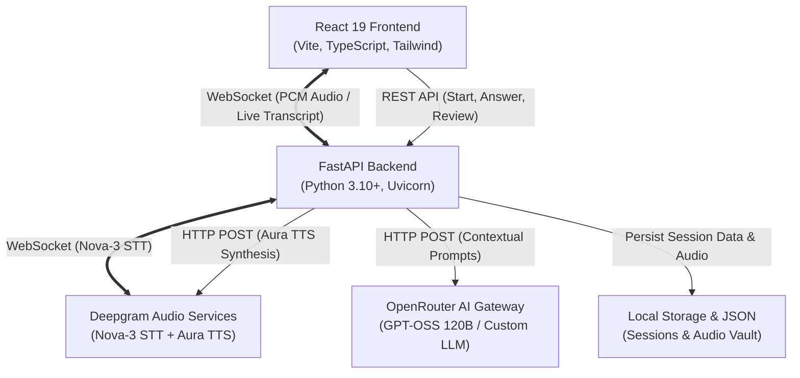

<div align="center">

# 🎓 InterTrain
### *AI-Powered Live Technical Interview & Multi-Modal Simulation Platform*

**Practice. Perform. Grow.**

[](https://react.dev/)
[](https://fastapi.tiangolo.com/)
[](https://deepgram.com/)
[](https://openrouter.ai/)
[](https://tailwindcss.com/)

---

</div>

## 📌 Overview & Concept

**InterTrain** is an end-to-end simulation environment engineered to prepare software developers for demanding real-world technical interviews. 

Most interview preparation tools rely on static flashcards, text-only question banks, or passive reading. In reality, technical interviews are dynamic, vocal, high-pressure evaluations where candidates must simultaneously explain algorithmic trade-offs, write code, articulate system architecture, and engage with interviewers in real time.

InterTrain bridges this gap by introducing:
- **Autonomous Multi-Agent AI Interviewers**: Three specialized AI panelists (Moderator, Technical Evaluator, Behavioral/Observer) evaluate technical accuracy, communication cadence, and behavioral composure.
- **Ultra-Low Latency Voice Pipeline**: Real-time bidirectional voice interaction powered by **Deepgram Nova-3** speech-to-text (WebSocket streaming) and **Deepgram Aura-2** text-to-speech synthesis.
- **Dynamic Context-Aware Questioning**: Powered by **OpenRouter**, interview questions organically adapt to the candidate's previous responses over 5 realistic rounds.
- **Dual Live Workspace**: Switch seamlessly between a **2x2 Multi-Agent Conference Room** (candidate webcam + 3 AI personas) and a full **VS Code-Style Integrated Development Environment** (code editor, terminal output, AI prompt panels, and webcam side-by-side).
- **Comprehensive Post-Interview Analytics**: In-depth scorecards covering overall rating, technical accuracy, conciseness, confidence metrics, and targeted improvement tips.

---

## 🚀 Key Features

| Feature | Description |
| :--- | :--- |
| **🎙️ Real-Time Voice STT & TTS** | Bidirectional voice streaming via WebSockets with instant transcriptions and natural conversational speech audio playback. |
| **👥 Multi-Agent AI Panel** | AI Moderator (agenda & structure), AI Technical Interviewer (code & architecture), and AI Behavioral Observer (cadence & STAR metrics). |
| **💻 Dual Workspace Layout** | Toggle between **Conference Mode** (face-to-face camera view) and **IDE Mode** (Monaco/VS Code code editor + live console + camera). |
| **⚙️ Hardware Readiness Check** | Interactive pre-interview setup to test camera permissions, microphone levels, and select difficulty (Junior, Intermediate, Senior). |
| **📊 Intelligent Scorecards & History** | Automated evaluation tracking history folders, metrics progress over time, and actionable recommendations. |
| **🔒 Frictionless Auth & Guest Mode** | Instant guest/demo login option for quick evaluation alongside standard credential workflows. |
| **🧭 Persistent Session URLs** | 19-digit section IDs synchronized to the browser URL (`/projects/:sessionId`) for shareable, reproducible interview sessions. |

---

## 🏗️ Architecture & Tech Stack



### Frontend
- **Framework**: React 19 with TypeScript
- **Bundler**: Vite
- **Styling**: Tailwind CSS with custom glassmorphism and dark mode aesthetics
- **Icons**: Lucide React
- **Audio & Media**: Web Audio API, MediaStream Recording API, HTML5 Audio

### Backend
- **Framework**: FastAPI (Asynchronous Python)
- **Server**: Uvicorn with standard ASGI workers
- **AI Gateway**: OpenAI Python SDK interfaced with OpenRouter API
- **Speech Engine**: Deepgram WebSocket Streaming (Nova-3) + REST TTS (Aura-2 Thalia)
- **Data Persistence**: JSON-based section state engine + file-backed WAV audio storage

---

## ⚡ Quick Start Summary

For comprehensive setup details, read [INSTRUCTIONS.md](INSTRUCTIONS.md).

```bash
# 1. Clone the repository
git clone https://github.com/DreamingVaishu/InterTrain.git
cd InterTrain

# 2. Setup and run Backend
cd Backend
python -m venv venv
# Windows:
.\venv\Scripts\activate
# Linux/macOS:
source venv/bin/activate
pip install -r requirements.txt
cp .env.example .env   # Fill in OPENROUTER_API_KEY and DEEPGRAM_API_KEY
uvicorn main:app --host 127.0.0.1 --port 8000 --reload

# 3. Setup and run Frontend (in another terminal)
cd ../Frontend
npm install
npm run dev
```

Visit **`http://localhost:3000`** in your browser!

---

## 📂 Documentation Directory

| Document | Content |
| :--- | :--- |
| 📖 [DOCUMENTATION.md](DOCUMENTATION.md) | In-depth technical architecture, data flows, API specs, and components breakdown. |
| 🛠️ [INSTRUCTIONS.md](INSTRUCTIONS.md) | Step-by-step installation, environment variables, dependencies, and troubleshooting guide. |


## Team Members
- Vaishnav Kadav (21F1002559)
- Aman Kanojiya (21F1002510)
- Chetna Bayas (21F1002517)
- Ashish Senger (21F1002508)
- Tanvi Khandare (21F1002547)
---
